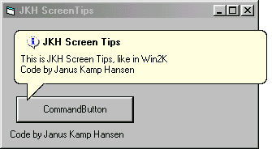



## JKH ScreenTips v1\.0

### Description

This ActiveX DLL shows a screentip like the ones shown i Windows 2000.

Use it almost the same way as the well know MsgBox.

I hope that it will be usefull..
 
### More Info
 
TipsScreen(Message as string, vbInformation as IconStyle, Header as string, ControlToPointAt as object

Download, unzip to an empty folder and run the "Test Group.VBG".. Press F5 and see what it does.

None that I've noticed.

             |
---                |---
**Submitted On**   |2001-04-09 14:10:44
**By**             |[Janus Kamp Hansen](https://github.com/Planet-Source-Code/PSCIndex/blob/master/ByAuthor/janus-kamp-hansen.md)
**Level**          |Intermediate
**User Rating**    |4.3 (17 globes from 4 users)
**Compatibility**  |VB 6\.0
**Category**       |[Custom Controls/ Forms/  Menus](https://github.com/Planet-Source-Code/PSCIndex/blob/master/ByCategory/custom-controls-forms-menus__1-4.md)
**World**          |[Visual Basic](https://github.com/Planet-Source-Code/PSCIndex/blob/master/ByWorld/visual-basic.md)
**Archive File**   |[JKH Screen18120492001\.zip](https://github.com/Planet-Source-Code/janus-kamp-hansen-jkh-screentips-v1-0__1-22205/archive/master.zip)

